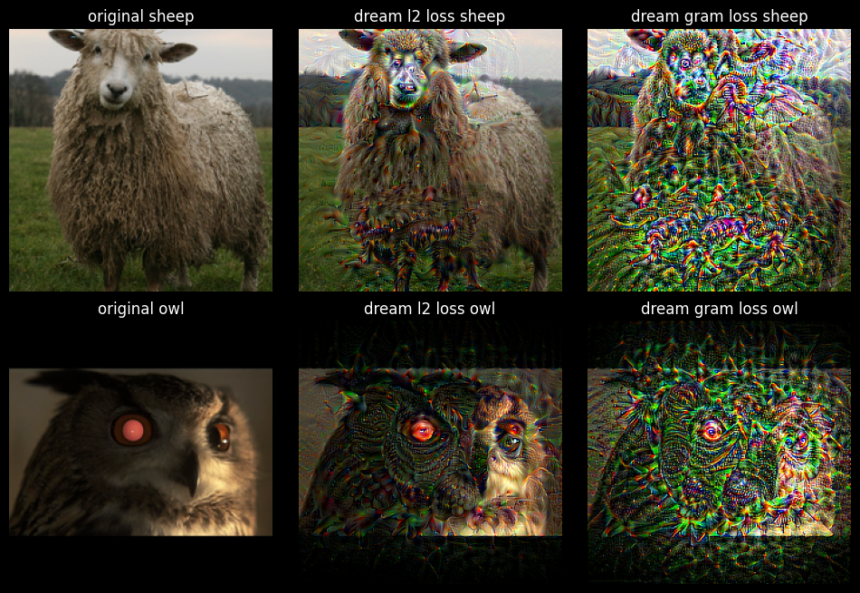

# Do image classifiers deepdream of electric sheep?

This project aims to look at the deepdream algorithm through the lens of mechanistic interpretability. I built a simple algorithm to visualize what aspects of an image a machine learning model uses to make classification predictions. I then pinpointed the parts of the model that were responsible for correctly predicting ships in order to modify the model to effectively “blind” it. After a quick lobotomy it made wildly inaccurate predictions when fed the same images.

This investigation serves to inform how models interpret styles, themes and elements, and how we can begin to interpret and control the outputs by diving into its internal workings. It also raises the question: if we can understand how AI classifies an image, can we alter it—maliciously or not—to be blind to a specific object or style? And why would we want to?

